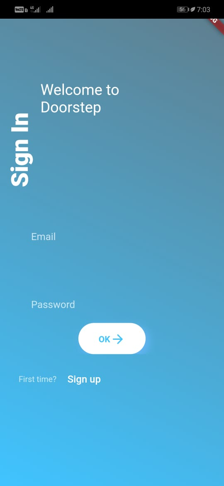
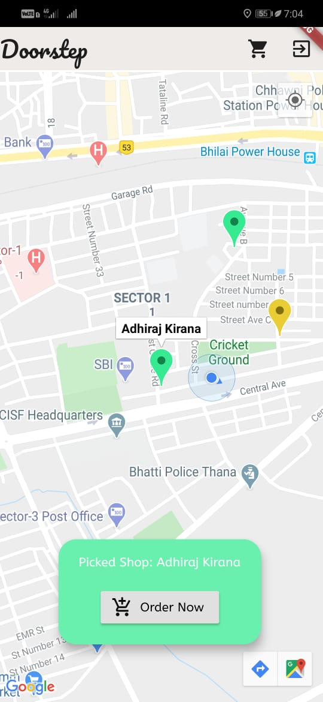
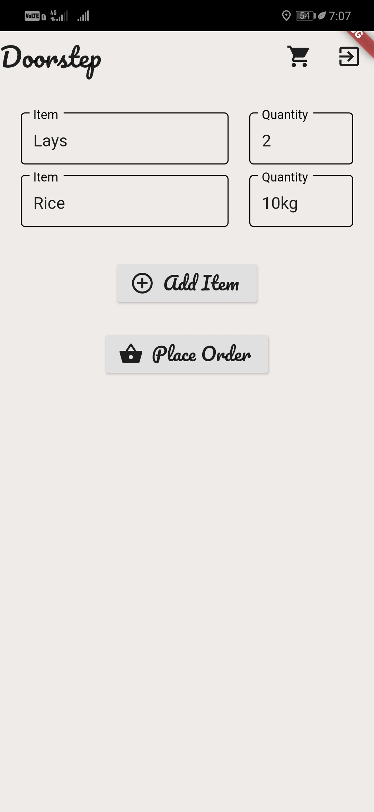
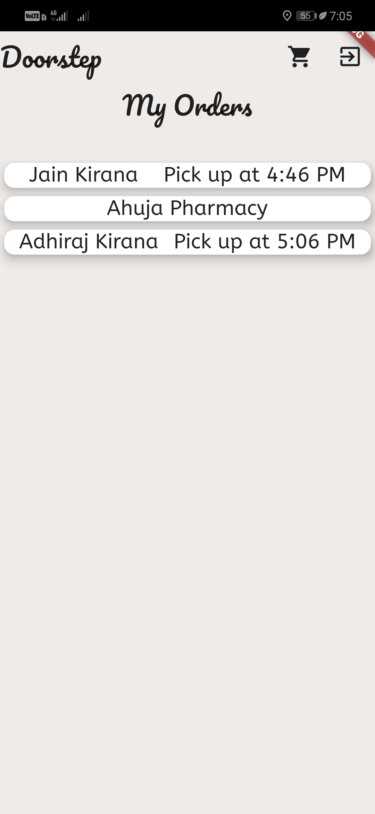
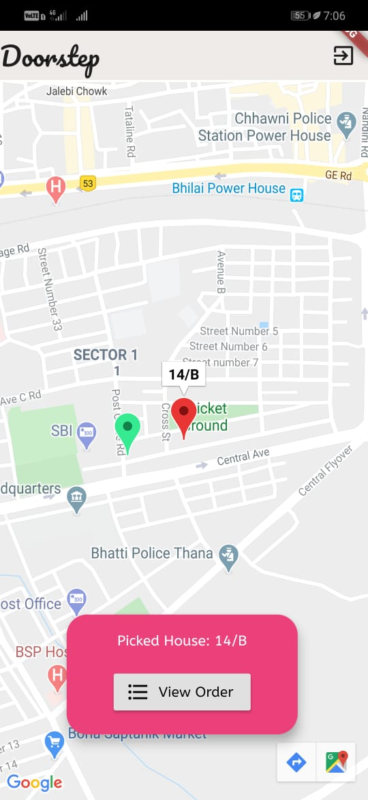
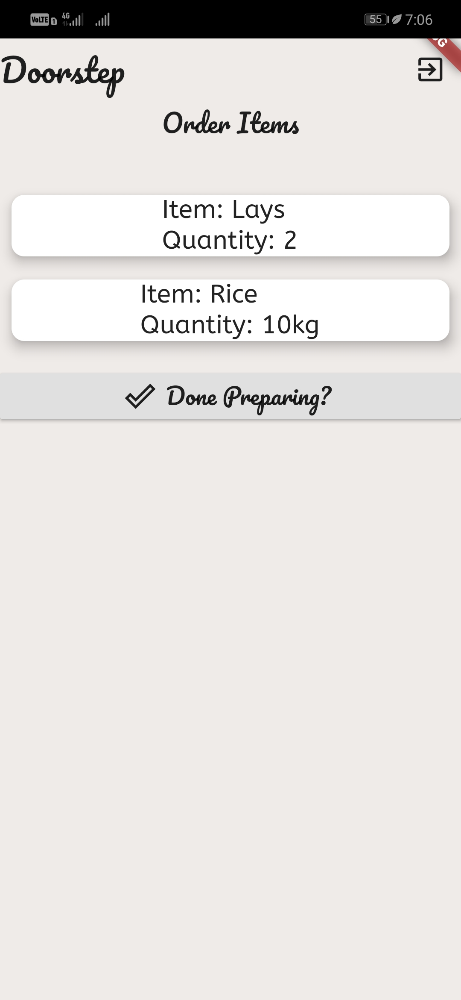
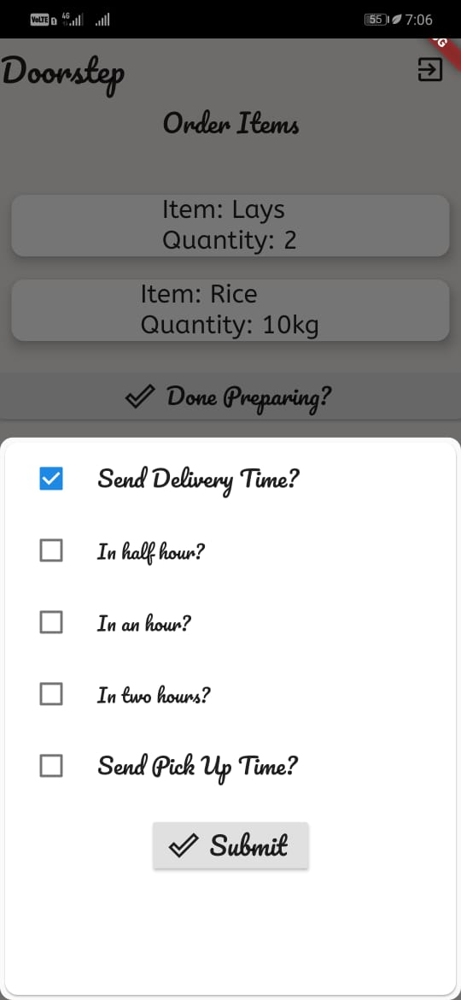

# Doorstep - An Android Application that keeps you home

Amidst alarming COVID-19 situation and ever an increasing lockdown in India, I realised people around me are risking their safety against a global pandemic because they wanted to buy groceries and medical supplies for their households. While well-known applications like *zomato* are providing options for home delivery of groceries, they have failed in reaching out to small grocery shop owners like the ones in my neighbourhood. Change starts at home, is the one thing that's always at the back of my head and so I fashioned an application called *Doorstep* which connects local shop owners to people around them. 
One thing that has to be kept in mind while building an application like this is that **not every grocery/medical shop delivers goods**. So in case of the ones that don't, I've constructed a mechanism that generates *pickup-times* for customers, keeping each one of them **ateast 10 minutes apart** to avoid crowding at the shop. That's how this application avoids **social intimacy** (It's got a nice ring to it!). 

## Screenshots
### Customer Sign In

  &nbsp;&nbsp;&nbsp;&nbsp;&nbsp;&nbsp;&nbsp;&nbsp;&nbsp;&nbsp;&nbsp;&nbsp;

### Shop owner Sign In

&nbsp;&nbsp;&nbsp;&nbsp;&nbsp;&nbsp;&nbsp;&nbsp;

